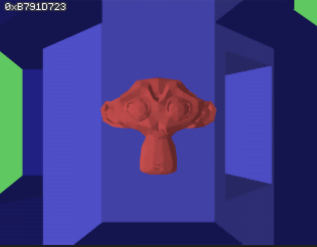

# n64-cylaby

This is Nintendo 64 homebrew built using libdragon.

## Features

- uses libdragon's magma
- Suzanne
- random maze generation
- runtime geometry generation

The random seed used to generate the current maze is drawn top-left.

### Controls

- analog stick to move
- A to go through a corridor
- Z to generate a new maze
